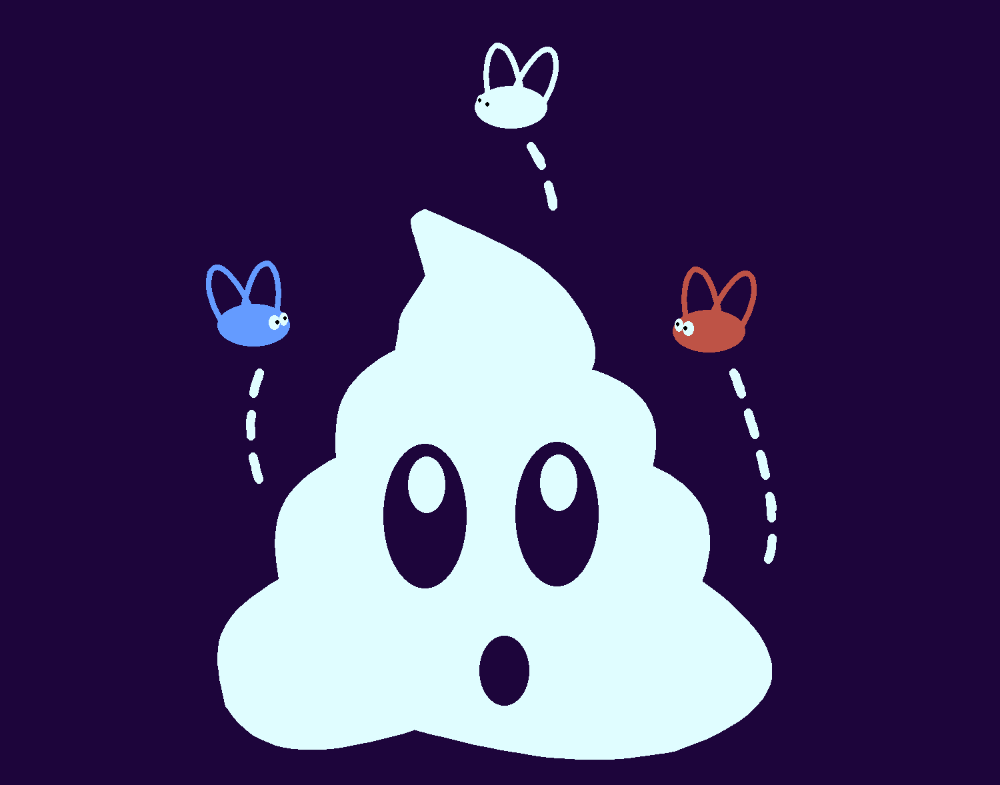

# Free twitter bot (FR only)



Because it's difficult to find a good and free twitter bot. This bot can fetch last tweet url and send a message to your discord channel.

## How to install it

- In the file bot.rb, update the following keys with your information from "CONFIGURATION" part: 
  - LOGIN: Your twitter username
  - PASSWORD: Your twitter password
  - HAS_PINNED_TWEET: If your account has a pinned tweet
  - DISCORD_TOKEN:
    - Go to the Discord developer portal and log in to your account.
    - Select your Discord application.
    - In the left-hand menu, click on the "Bot" tab.
    - In the "Token" section, click on the "Copy" button to copy the bot's token.
  - DISCORD_CLIENT_ID:
    - Still in the "Bot" tab of the Discord developer portal, you'll find the ID of the bot's client under the "APP BOT USER" section. Make a note of this ID.
  - CHANNEL_ID:
    - On your Discord server, right-click on the channel where you want your bot to send messages.
    - Select "Copy ID" to copy the channel ID.
  - CALL_WITH_MESSAGE:
    - If you want to use the bot with the message !tweet, set this value to true
    - If you don't want to use the bot with the message !tweet, set this value to false

## How to use it

- Manually: In your terminal, ```bundle exec ruby bot.rb```
  - !tweet: To fetch the last tweet and to send to your discord channel
  - !stop_bot: To stop your bot
- Automatically: 
  - Use crontab, or other stuff ...
  - Check the permissions on the file bot.rb

## How to contribute

Feel free to help if you have an idea.

## TODO

- Fix with crontab ?
- Add languages EN

## Licence

This is free.
